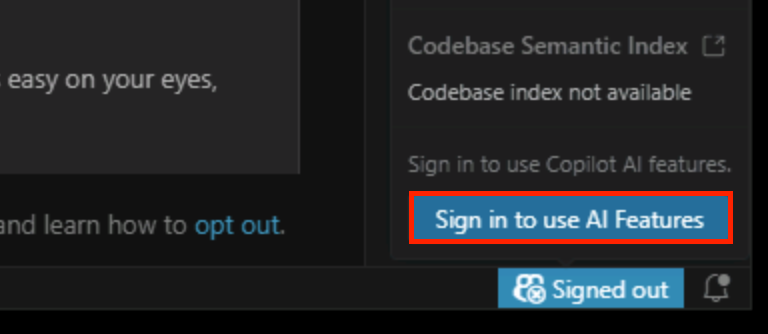

# Setup & prerequisites

Before you can build, deploy, and explore the work-order app, you need to get your environment ready and sign in to GitHub, GitHub Copilot, and Microsoft Fabric.

## Prerequisites

Every tool and account needed is already installed in this guided lab, but here's what we'll use as a reference.

| | Guided lab | Your own environment |
|---|---|---|
| **Node.js 24+** | ✅ Pre-installed | Install from [nodejs.org](https://nodejs.org/) (LTS or current ≥ 24) |
| **npm** | ✅ Pre-installed | Bundled with Node.js |
| **Docker Desktop** | ✅ Pre-installed | Install from [docker.com](https://www.docker.com/products/docker-desktop/) and make sure it's running before you start the lab |
| **Visual Studio Code** | ✅ Pre-installed | Install from [code.visualstudio.com](https://code.visualstudio.com/) |
| **GitHub Copilot CLI** | ✅ Pre-installed | Run `npm install -g @github/copilot` |
| **GitHub account with Copilot access** | Use the lab account | Use your own GitHub account with an active Copilot subscription |
| **Microsoft Fabric capacity** | Use the lab account | Bring your own Microsoft Fabric tenant |

> [!TIP]
> Even on the Skillable VM you still need to **sign in** to each service below.

## 1. Start Docker Desktop

The local tools we'll use runs in containers, so Docker needs to be up before you can test the app later.

On the desktop, double-click the **Docker Desktop** icon to start it, and keep it running in the background for the rest of the lab.

> [!TIP]
> You can leave Docker starting in the background and continue with the next sign-in steps.

## 2. Sign in to GitHub through the lab SSO portal

The lab uses a GitHub Enterprise SSO portal to grant access to GitHub Copilot.

1. Open a browser and go to:

   **<[https://github.com/enterprises/skillable-events/sso](https://github.com/enterprises/skillable-events/sso)**

2. Sign in with these **Azure credentials**:
	- Username: `@lab.CloudPortalCredential(User1).Username`
    - Temporary Access Pass: `@lab.CloudPortalCredential(User1).AccessToken`

3. Once you're signed in, **keep this browser tab open** — Visual Studio Code will use this active session in the next step.

## 3. Sign in to GitHub Copilot in Visual Studio Code

1. Open Visual Studio Code.
2. Click the **Copilot** icon at the bottom-left of the window and choose **Sign in to use AI Features**.
    
3. When prompted to choose a sign-in method, select **Continue with GitHub**.
4. Complete the browser flow using the SSO session you opened in the previous step.
5. Confirm the Copilot icon appears in the status bar with no error indicator.

## 4. Sign in to GitHub Copilot CLI

The GitHub Copilot CLI uses its own sign-in, separate from Visual Studio Code.

1. In Visual Studio Code, right-click in an empty space of the editor area's tabs bar and select **New Terminal** to open a terminal pane.
2. Start the Copilot CLI:

   ```sh
   copilot
   ```

3. When asked whether to trust the current folder, choose **Yes, and remember this folder for future sessions**.
4. At the Copilot CLI prompt, run:

   ```
   /login
   ```

5. When asked which account to sign in with, choose **GitHub.com**.
6. The CLI will display a device code and a URL. Copy the code, open the URL in your browser, paste the code, and complete the device authorization flow using the SSO session from Step 2.
7. *(Optional)* If the Copilot CLI prompts you that an update is available, run:

   ```
   /update
   ```

   to make sure you're on the latest version.
8. Once you see the signed-in confirmation in the CLI, type `/exit` (or press `Ctrl+C`) to leave the prompt. 

## 5. Sign in to Microsoft Fabric

1. In a browser, open <[https://app.fabric.microsoft.com](https://app.fabric.microsoft.com).
2. Sign in with these **Azure credentials**:
	- Username: `@lab.CloudPortalCredential(User1).Username`
    - Temporary Access Pass: `@lab.CloudPortalCredential(User1).AccessToken`
3. Confirm the Fabric portal loads.

## 6. Create a Fabric workspace and assign capacity

The lab deploys your app to a Microsoft Fabric workspace, which must be backed by a Fabric capacity.

1. In the Fabric portal, open **Workspaces** in the left navigation and click **+ New workspace**.
2. Give it a **unique** name (Fabric workspace names must be unique across the tenant). Add something distinctive like your initials or a random suffix, for example `lab514-workorders-<your-initials>`.
3. Expand **Advanced** → **Workspace type** and ensure **Fabric** is selected.
4. Pick the capacity:
   - **Guided lab:** Under **Details**, you should see a Fabric capacity already assigned to this workspace.
   - **Your own environment:** select your own Fabric capacity. If you don't have once, you can choose to activate a **Fabric trial**.
5. Click **Apply** to create the workspace.

You'll deploy into this workspace later in the lab.

---

## ✅ Verify your setup

Back in the Visual Studio Code terminal you opened in Step 4, run these commands. All should succeed:

```sh
node --version          # v24.x.x
npm --version           # 10.x or newer
docker --version        # Docker version 24+ (and `docker ps` works)
copilot --version       # GitHub Copilot CLI version
```

If any command fails, fix it before moving on. The rest of the lab assumes everything above is working.

Select **Next →** to start the first exercise.

