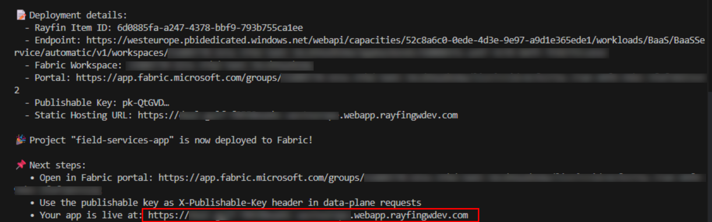

# Exercise 5: Verify the Production Deployment on Microsoft Fabric

In Exercise 4, you ran **npx rayfin up** to provision the Rayfin backend in Microsoft Fabric. That command also built the frontend by running **npm run build:fabric**, uploaded the compiled app to Microsoft Fabric's managed static hosting, and deployed the schema.

In this exercise, you will verify the live deployment created by **rayfin up**. There is no separate production publishing step for this lab: each **rayfin up** updates the deployment associated with your selected Microsoft Fabric workspace.

You will:

- Open the hosted app URL generated by **rayfin up**
- Sign in with Microsoft Fabric
- Confirm that the hosted app uses the same backend, database, and schema as the app you tested locally
- Optionally inspect the deployed app and SQL Database items in the Microsoft Fabric portal

## Task 1: Open the live app

1. In the terminal output from the **npx rayfin up** command you ran in Exercise 4, find the **static hosting URL** printed by the CLI. The URL should look similar to `https://<random-prefix>.webapp.rayfin….com`.

    

    > [!TIP]
    > If you missed the hosting URL, run `npx rayfin up status` from the **field-services-app** folder to print the current deployment details.

1. Open the hosting URL in a new browser tab. The app displays the same auth page as your local frontend, including the **Sign in with Microsoft** button, because both use the same Fabric backend.

1. Select **Sign in with Microsoft** just like you did in Exercise 4.

1. After authentication completes, confirm that you land in the Service Pro view.

1. Confirm that you can see the same profile and work orders you created in the previous exercise. This verifies that the hosted app is using the same database as the app you tested locally.

1. Navigate to `/manager/` and create a couple of new work orders.

At this point, you have verified that the app is live. Any user with access to your Microsoft Fabric workspace can open the hosted app and use the deployed backend.

> [!Tip]
> **Need separate dev and production environments?** Run `npx rayfin up` against a second Microsoft Fabric workspace to create a separate deployment with its own backend, database, and frontend. Then switch between deployments anytime with `npx rayfin up switch`. Each deployment is tracked independently in **rayfin/.deployments.json**.

## Task 2: Inspect the deployment in Fabric

Let's take a look at the deployed app and database in the Microsoft Fabric portal.

1. Open the Microsoft Fabric portal at `https://app.fabric.microsoft.com`.

1. Open the **Lab514-workorders-@lab.LabInstance.Id** workspace you created in Exercise 1.

1. Confirm that the workspace contains a **Fabric data app** item and a **SQL Database** item. The **ServicePro** and **WorkOrder** tables are stored in the SQL Database item.

1. Select the Fabric SQL Database item to open it, and in the left explorer, expand the **field-services-app** database and then expand **dbo > Tables** to see the **ServicePro** and **WorkOrder** tables.

1. Select each table to see the data contained within it.

    

Continue with **Next →** to update the app with a new feature.
