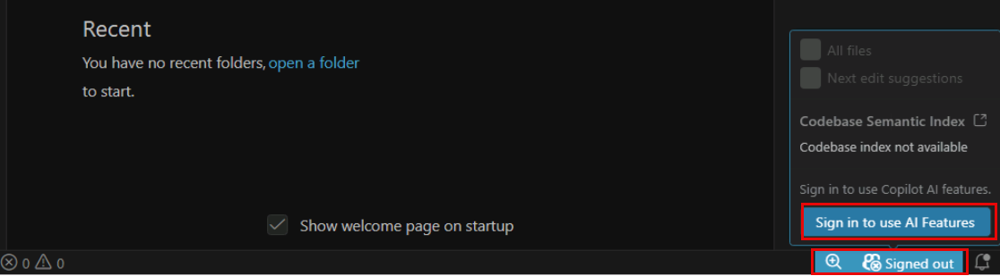

# Exercise 1: Setup Your Environment

Before you can build, deploy, and explore the work-order app, you need to get your environment ready by signing in to GitHub, GitHub Copilot, and Microsoft Fabric.

This lab uses a pre-configured virtual machine with all necessary tools installed. The already pre-installed tools include:

- Node.js 24
- npm
- Docker Desktop
- Visual Studio Code
- GitHub Copilot CLI

## Task 1: Sign in to GitHub through the lab SSO portal

In this exercise, you will sign in to GitHub through Contoso DIY's enterprise SSO portal. Contoso DIY purchases GitHub Enterprise for its organization, which includes managed access to GitHub Copilot for employees through the company's enterprise plan.

1. In the virtual machine, open Microsoft Edge and navigate to: `https://github.com/enterprises/skillable-events/sso`

1. On the Single Sign-On page, select **Continue** and sign in using the following credentials:

- **Email**: `@lab.CloudPortalCredential(User1).Username`
- **TAP**: `@lab.CloudPortalCredential(User1).AccessToken`

1. After a successful sign-in, you will be redirected to the GitHub homepage. **Keep this browser tab open** as you will need this active session for the next steps.

## Task 2: Sign in to GitHub Copilot in Visual Studio Code

1. In the virtual machine, from the taskbar, open **Visual Studio Code**.

1. Select the **Copilot** icon at the bottom-left of the Visual Studio Code window and select **Sign in to use AI Features**.

    

1. Select **Continue with GitHub** in the dialog to choose a sign-in method.

1. A new browser window will open prompting you to sign in to GitHub. Since you are already signed in through the SSO portal, you can simply authorize Visual Studio Code to access the GitHub account by selecting **Continue**.

1. In the next page that asks for permissions, select **Authorize Visual Studio Code** and you should see a dialog redirecting you back to Visual Studio Code. Select **Open** to return to Visual Studio Code.

1. Confirm that the Copilot icon in the status bar no longer shows **Signed out**.

## Task 3: Sign in to GitHub Copilot CLI

The GitHub Copilot CLI uses its own authentication separate from Visual Studio Code, so you need to sign in to the CLI as well.

1. In Visual Studio Code, open a new terminal by selecting **View** > **Terminal** from the toolbar.

1. In the terminal, start the Copilot CLI by running: `copilot`.

1. When prompted with "Do you trust the files in this folder?", select **Yes, and remember this folder for future sessions** by navigating with the arrow keys and pressing Enter.

1. Run the following command in the Copilot CLI to start the login process: `/login`.

1. When prompted to choose a sign-in method, select **Github.com**.

1. Press any key to open the browser and sign in using the SSO session from Task 1. The device code is copied to your clipboard automatically, so paste it into the browser when asked.

1. After a successful sign-in, return to the terminal and confirm that you see "Signed in successfully" in the output.

1. *(Optional)*  If the Copilot CLI prompts you that an update is available, run: `/update` to update to the latest version.
1. Exit the Copilot CLI by running: `/exit`. You will start it again in the next exercise when you use it to generate code.

## Task 4: Sign in to Microsoft Fabric

1. In the browser, navigate to the Microsoft Fabric portal at: `https://app.fabric.microsoft.com`.

1. When prompted to sign in, use the following credentials:

- **Email**: `@lab.CloudPortalCredential(User1).Username`
- **Password**: `@lab.CloudPortalCredential(User1).Password`

>Note: Since you already used these credentials to sign in to the SSO portal, you may not be prompted to enter them again and will be signed in automatically.

## Task 5: Create a Workspace in Fabric

This lab deploys your work-order app to Microsoft Fabric, which requires you to have a workspace. A workspace is a container for all your data and analytics in Microsoft Fabric.

1. In the Fabric portal, select **Workspaces** from the left-hand navigation pane. Then select **+ New workspace**.

1. Enter a name for the workspace such as `Lab514-workorders-@lab.LabInstance.Id`. Expand the **Advanced** section and navigate to the **Workspace type** setting to ensure that **Fabric** is selected.

1. Select **Apply** to create the workspace.

---

## Verify Your Setup

Navigate back in Visual Studio Code to the terminal and run the following commands to verify that your environment is set up correctly:

1. To verify that you have the latest version of Node.js installed, run the following command:

```shell
node --version
```

1. To verify that you have the latest version of npm installed, run the following command:

```shell
npm --version
```

1. To verify that you have docker installed and running, run the following command:

```shell
docker --version
```

1. To verify that you have GitHub Copilot CLI installed and running, run the following command:

```shell
copilot --version
```

Next → [2. Bootstrap app from template](../instructions/exercise-2-bootstrap-app-template.md)
