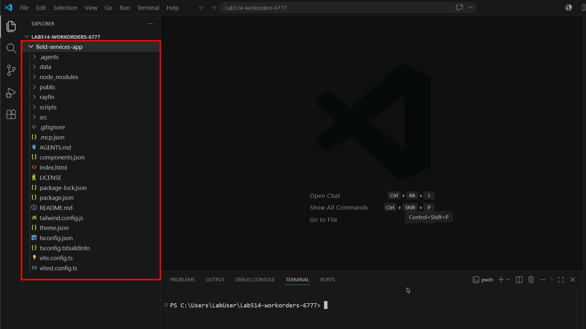

# Exercise 2: Bootstrap App from Template

In this exercise, you'll create a new Rayfin project from the **Field Services** template.

The template handles the setup for you, so you can focus on the lab.
> [!Tip]
> In this lab environment, the template is available locally at `C:\LabFiles\template\field-services-app`. The `rayfin` CLI knows how to find it by name.

## Task 1: Bootstrap a new Rayfin project from the Field Services template

1. Open a new folder in Visual Studio Code by selecting **File** > **Open Folder** from the toolbar, then create a new folder in the Home directory that opens, name it `Lab514-workorders-@lab.LabInstance.Id`, and select **Select Folder** to open it.

1. Select **Yes, I trust the authors** in the pop-up that appears asked if you trust the files in this folder.

1. Open a terminal in Visual Studio Code by selecting **View** > **Terminal** from the toolbar.

1. Type/Add the following command into the terminal, but do not press **Enter** yet. Leave `<workspace-uri>` in place for now.

    ```shell
    npm create @microsoft/rayfin@latest -- --project-name field-services-app --template "C:/LabFiles/template/field-services-app" --workspace-uri <workspace-uri>
    ```

1. Navigate back to your browser where you have the Microsoft Fabric portal open.

1. In the left-hand navigation pane, select **Workspaces** and then select the `Lab514-workorders-@lab.LabInstance.Id` workspace you created in Task 5 of the previous exercise.

1. Once the workspace loads, copy the URL from the browser address bar. Remove anything after the workspace ID. The URL should look like `https://app.fabric.microsoft.com/groups/<workspace-id>`.

1. Return to the terminal. In the command you pasted, replace `<workspace-uri>` with the Fabric workspace URL you just copied, then press **Enter** to bootstrap a new Rayfin project from the Field Services template.

1. When prompted, type `y` and press **Enter** to approve the installation of the npm packages. The CLI will then:
    - Create a new folder called `field-services-app` in your current directory.
    - Copy the template files into a new `field-services-app` folder.
    - Wire the project to your Fabric workspace using the `--workspace-uri` you provided.
    - Run `npm install` in the new project folder to pull dependencies (this can take a couple of minutes on first run).

1. As this is running, open the `/data` folder at *C:\LabFiles\template\field-services-app* to see the original prompt and dataset used to generate this template. This will give you a better understanding of how the app was built and ideas on how to customize it later in the lab.

## Task 2: Explore the generated project and make your first commit

In this task, you will inspect the generated project, initialize a Git repository, and make your first commit. This is important for GitHub Copilot CLI in later exercises, as it will show you clean diffs and what it will be changing when you ask it to generate code.

1. In the Visual Studio Code Explorer, expand the `field-services-app` folder that was created by the bootstrap command.

    

1. Review the project structure. It should look something like this:

    - `src/`: React + TypeScript frontend
    - `rayfin/`: Rayfin backend configuration (`rayfin.yml`, data entities)
    - `data/`: Seed data and **the original prompt + dataset used to generate this template** (worth a look if you're curious how it was built)
    - `package.json`: Dependencies and scripts for the project, including `build` and `dev`.

1. In the terminal run the following command to navigate into the new project folder:

    ```shell
    cd field-services-app
    ```

1. Run this command to initialize a new Git repository:

    ```shell
    git init
    ```

1. Next, add all the files to the staging area with this command:

    ```shell
    git add .
    ```

1. Finally, make your first commit with this command:

    ```shell
    git commit -m "Initial commit - bootstrap from template"
    ```

---

Next → [3. Explore the Project](../instructions/exercise-3-explore-template.md)
