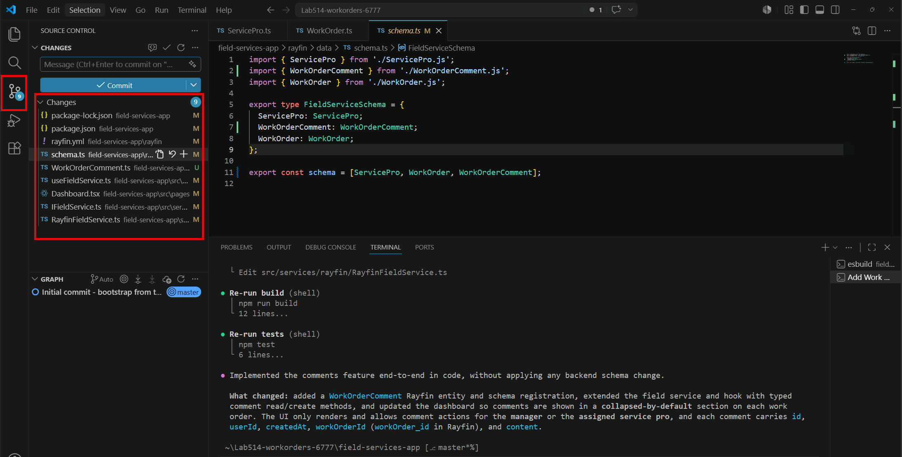

# Exercise 6: Add a Feature with Copilot CLI

In the previous exercises, you deployed the Field Services app to Microsoft Fabric and confirmed that the hosted app uses the same Rayfin backend as your local development experience. In this exercise, you will use GitHub Copilot CLI to implement a schema-backed comments feature for work orders.

The comments feature gives each work order a conversation thread where service pros and managers can discuss job details over time. Implementing this feature requires changes across the Rayfin data model, permissions, typed data access, and React user interface.

By completing this exercise, you will:

- Review the project-specific agent instructions that guide GitHub Copilot CLI.
- Launch GitHub Copilot CLI from the Field Services app project.
- Generate a Rayfin-backed `Comment` entity and comments user interface.
- Review the generated schema, permission, data access, and frontend changes.
- Apply the schema update to the Microsoft Fabric backend.
- Redeploy the app and validate the comments workflow locally and in the hosted app.

## Task 1: Review the project agent instructions

The app template includes agent instructions that help GitHub Copilot CLI generate Rayfin code that follows the project's conventions.

The Rayfin agent skill provides domain guidance for entities, decorators, permissions, schema updates, and typed client usage. The project-level `AGENTS.md` file adds repository-specific context, including architecture notes, important files, and implementation conventions.

1. In Visual Studio Code, open the `field-services-app` project folder.

1. Open `AGENTS.md` at the project root.

1. Review the guidance so you understand the context GitHub Copilot CLI will use while editing this project.

1. Open `package.json` and confirm that `@microsoft/rayfin-mcp` is listed in the development dependencies.

    > [!Tip]
    > The template installs the Rayfin agent skill automatically. If you start from a blank project in the future, install the agent files by running `npx rayfin init ai-files install` from the project folder.

## Task 2: Launch GitHub Copilot CLI

Start GitHub Copilot CLI from the app project folder so it can read the project files, agent instructions, and Rayfin configuration.

1. Open a terminal in Visual Studio Code.

1. Confirm that the terminal is in the `field-services-app` folder. If not, navigate to it with:

    ```shell
    cd field-services-app
    ```

1. Launch GitHub Copilot CLI:

    ```shell
    copilot --yolo
    ```

    > [!Tip]
    > The `--yolo` option automatically approves tool calls such as file edits and terminal commands. Use it only in a controlled lab workspace that does not contain secrets, production data, or changes you cannot easily revert.

1. At the GitHub Copilot CLI prompt, open the model picker:

    ```text
    /model
    ```

1. Select **GPT-5.4** and choose **low** reasoning effort.

    > [!Tip]
    > The model selection applies to the current GitHub Copilot CLI session. If you exit and start GitHub Copilot CLI again, repeat this step.

## Task 3: Generate the comments feature

Use GitHub Copilot CLI to generate the comments feature without applying the backend schema change yet.

1. In the GitHub Copilot CLI prompt, paste the following implementation request:

    ```text
    Implement a comments feature for work orders. Comments should provide a history of interventions so service pros and the manager can communicate and ask questions about a work order. Each comment must include id, userId, createdAt, workOrderId, and content. Keep the comments section collapsed by default in the UI. Only the service pro assigned to the work order and the manager can view and add comments for a work order. Generate the code only; do not apply the backend schema change.
    ```

1. Allow GitHub Copilot CLI to plan and apply the code changes.

1. As the implementation runs, confirm that GitHub Copilot CLI is making changes consistent with the request, including:

    - A new `Comment` entity under `rayfin/data/`
    - An update to `rayfin/data/schema.ts` that exports the new entity
    - Permission logic that limits comments to the assigned service pro and the manager
    - React user interface changes that add a collapsed-by-default **Comments** section to work-order details
    - Typed Rayfin client calls that fetch and create comments

    > [!Note]
    > Your entity could be named `Comment` or `WorkOrderComment` or something similar. The important part is that it includes the required fields and is properly exported from the schema. For purposes of this lab, the instructions will refer to it as `Comment`, but the actual name may vary.

## Task 4: Review the generated implementation

Before applying backend changes, review the files generated by GitHub Copilot CLI.

1. Open the Visual Studio Code Source Control view.

    

1. Review each changed file.

1. Confirm that the implementation includes a comment entity, schema registration, permission logic, data access updates, and user interface updates.

1. If you prefer the terminal, run `git status` or `git diff` from the `field-services-app` folder to inspect the same changes.

Expected changes include:

- A new file under `rayfin/data/`, such as `Comment.ts`
- An update to `rayfin/data/schema.ts`
- New or updated files under `src/components/`, `src/pages/`, `src/hooks/`, or `src/services/`
- A comments user interface that is collapsed by default

> [!Note]
> The implementation should rely on Rayfin decorators, schema generation, permission policies, and the typed client. You should not need to create a hand-written REST endpoint, migration script, or authorization middleware for this feature.

## Task 5: Apply the schema update and redeploy

The implementation request asked GitHub Copilot CLI to generate code without applying backend changes. To test the feature, apply the new schema to the Microsoft Fabric backend and redeploy the app.

1. In a terminal in the `field-services-app` folder, apply the database schema update:

    ```shell
    npx rayfin up db apply
    ```

1. Confirm that the command completes successfully and creates the new `Comment` table.

    If the command warns about destructive changes, stop and review the listed operations before continuing. Adding a new entity should not require dropping or renaming existing columns.

1. Deploy the updated backend API metadata and frontend:

    ```shell
    npx rayfin up
    ```

    The full `rayfin up` flow can also apply pending database migrations. In this lab, you applied the database change first so the schema update is visible as a separate step.

1. If your local Vite dev server is still running from Exercise 4, restart it so it picks up the updated frontend code.

    Stop the existing server with **Ctrl+C**, then run:

    ```shell
    npm run dev
    ```

## Task 6: Validate the comments workflow

Test the comments feature from both the local development app and the hosted app.

1. Open the local app at the Vite dev server URL, such as `http://localhost:5173`.

1. Sign in with Microsoft.

1. Open a work order assigned to your Service Pro profile.

1. Expand the new **Comments** section.

1. Add a comment to the work order.

1. Navigate to the manager view at `/manager/`.

1. Open the same work order and confirm that the manager can see the comment thread.

1. Add a reply from the manager view.

1. Return to the Service Pro view and confirm that the reply appears in the same thread.

1. Open the live hosting URL from Exercise 5 and repeat a quick smoke test to confirm that the deployed app also includes the comments feature.

## Task 7: Refine the implementation if needed

If the feature does not work as expected, use GitHub Copilot CLI to make a targeted fix. Include the observed behavior, error message, or screenshot details in your follow-up prompt.

Example follow-up prompts:

```text
The Comments section is not collapsed by default. Please fix it.
```

```text
This error appears when I post a comment: <paste the error message>. Please fix it.
```

```text
The manager cannot see comments on assigned work orders. Please review the permissions and fix the issue.
```

After GitHub Copilot CLI applies a fix, repeat the relevant validation steps from Task 5 and Task 6.

---

## ✅ Verify

- A new `Comment` entity exists in `rayfin/data/` and is exported from `rayfin/data/schema.ts`.
- The comments entity includes the required fields: `id`, `userId`, `createdAt`, `workOrderId`, and `content`.
- `npx rayfin up db apply` succeeds and the Microsoft Fabric backend includes the `Comment` table.
- `npx rayfin up` completes successfully and deploys the updated frontend.
- The work-order user interface includes a **Comments** section that is collapsed by default.
- A service pro can post comments on an assigned work order.
- The manager can view and reply to the same comment thread.
- The feature works from both the local Vite URL and the live hosting URL.

You have completed the feature implementation and validation workflow for the Field Services app.

Next → [7. Seed Data for Analysis](../instructions/exercise-7-seed-data.md)
