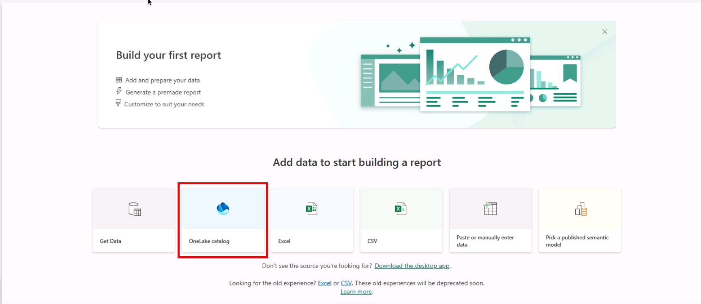
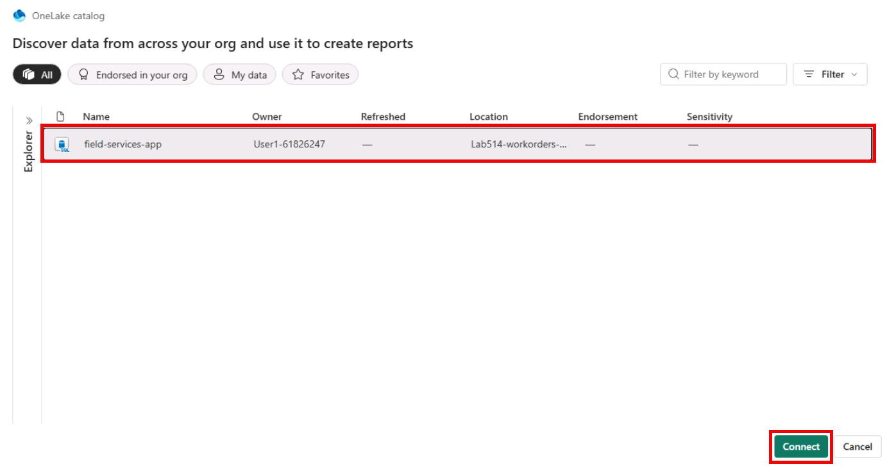
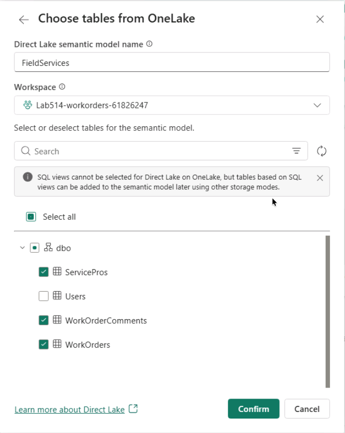
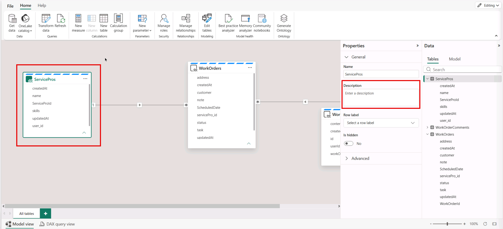
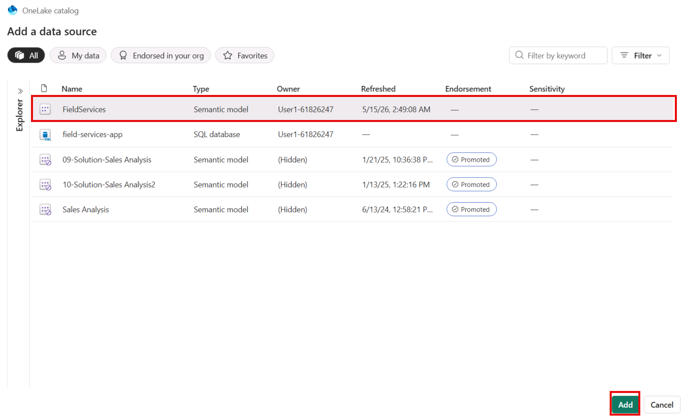

# Exercise 8: Explore Data with Fabric Intelligence

In Exercise 7, you seeded the database with a realistic production dataset. In this exercise, you will use Microsoft Fabric intelligence capabilities to query that data using natural language.

The Microsoft Fabric SQL Database provisioned by Rayfin is a first-class citizen in your Fabric workspace. You will build a Power BI semantic model over it, publish it to Fabric, and create a **Fabric data agent** that lets you ask questions like "Which Service Pro has the most completed jobs?" without writing a single line of SQL.

By completing this exercise, you will:

- Build and publish a semantic model over the service pro, work order, and comments tables.
- Create a Fabric data agent backed by the semantic model.
- Query the agent with natural-language questions about your production data.
- Optionally call the agent from a Fabric notebook using the Fabric Data Agent SDK.

## Task 1: Build a Semantic model

A semantic model gives the data agent a clean, well-described view of your data — including table relationships, friendly column names, and descriptions so it can translate natural-language questions into accurate queries.

1. Navigate to the Microsoft Fabric portal and open the workspace you created for this lab.

1. Select **+ New item** from the top menu and in the dialog, search and select **Semantic model**.

1. In the semantic model creation experience, select **OneLake catalog** as the data source type.

    

1. Select the SQL Database item and select **Connect**.

    

1. Provide a name for the semantic model, in this case, `FieldServices`.

1. Select the `ServicePros`, `WorkOrders`, and `WorkOrderComments` tables to include in the model and select **Confirm** to create the model.

    

    > [!Note]
    > This process will take a few minutes to complete.

1. Define the relationship between the `ServicePros` and `WorkOrders` tables by dragging the `servicePro_id` column from `WorkOrders` onto the `id` column in `ServicePros`.

1. Power BI Service will automatically determine the cardinality and cross-filtering direction. Select **Save** in the New relationship dialog.

1. Define the relationship between the `WorkOrders` and `WorkOrderComments` tables by dragging the `id` column from `WorkOrders` onto the `workOrder_id` column in `WorkOrderComments`.

1. Again, confirm the relationship settings in the New relationship dialog and select **Save**.

1. Rename key columns to clear, readable labels. For each of the three tables rename the following columns:

    a. ServicePros:
    - `id` → `ServiceProId`

    b. WorkOrders:
    - `id` → `WorkOrderId`
    - `scheduledAt` → `ScheduledDate`

    To rename a column, select it in the **Data** view, then expand each table to view its columns. Right-click the column and select **Rename**.

1. Select each table and add descriptions to the tables from the **Properties** pane.

    

    The descriptions are as follows:

    - ServicePros: `Service professionals who perform jobs at customer locations. Each has a set of skills and may be assigned to work orders.`
    - WorkOrders: `Work orders for field service jobs. Each has a status, may be assigned to a Service Pro, and has a scheduled date.`
    - WorkOrderComments: `Comments on work orders. Each comment is associated with a single work order and includes content, the authoring user, and a timestamp.`

    > [!Tip]
    > Adding descriptions is optional but highly recommended, as the data agent uses them to understand your data and answer questions accurately. Spend a few minutes here, it pays back tenfold in agent answer quality.

## Task 2: Create a Fabric data agent

1. Switch to your workspace on the left navigation pane and select **+ New item** from the top menu.

1. In the dialog, search for and select **Data agent**.

1. Name the agent `field-services-agent`.

1. In the **Explorer** panel, select **Add Data > Data Source**.

1. In the **Add data source** dialog, select the **Semantic model** you created in Task 1 and select **Add**.

    

1. In the explorer panel, select the tables you want the agent to have access to. Check the boxes next to `ServicePros`, `WorkOrders`, and `WorkOrderComments`.

1. Select **Agent Iinstructions** in the toolbar and add the following domain context, deleting any placeholder text:

    ```text
    This is a field-services work-order management app. Service Pros perform jobs at customer addresses. WorkOrders have a status (pending, assigned, in_progress, completed, needs_followup, cancelled) and may be assigned to one ServicePro. Use Scheduled date for time-based questions about when jobs happen.
    ```

1. Close the Agent Instructions editor.

## Task 5: Query the agent with natural-language questions

Use the agent's chat interface to ask questions about your seeded production data.

1. In the agent chat pane, ask the following questions one at a time and review the results:

    - `How many work orders do we have in total?`
    - `How many work orders are assigned to each Service Pro?`
    - `Which Service Pro has the most completed jobs?`
    - `List all work orders scheduled for the next 7 days.`
    - `Which Service Pros have plumbing in their skills and have no in-progress jobs?`

1. For each response, expand the steps completed to see the generated DAX query and the returned answer.

1. Publish the data agent by selecting **Publish** from the top toolbar. Once published, the agent can be accessed from other Fabric experiences such as notebooks and the standalone Copilot experience.

1. In the publish dialog, provide the following description for the agent:

    ```text
    This agent answers questions about field service work orders, including assigned service professionals, job statuses, and scheduled dates.
    ```

    > [!Tip]
    > The description is important as it helps other agents and copilot experiences understand the agent's purpose and capabilities. A clear description improves the chances of the agent being recommended for relevant questions.

1. Select the **Standalone Copilot** from the left navigation pane.

1. In the Copilot text input, ask a question that the agent should be able to answer, such as:

    ```text
    Which Service Pro has the most completed jobs?
    ```

    You should see the response from copilot using the data agent as its knowledge source.

You have successfully created a Fabric data agent over your production data and used it to answer natural-language questions.

Continue with **Next →** for the conclusion of the lab and next steps.